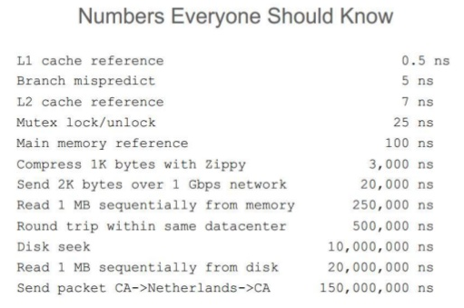

## UUID的性能

### 背景知识简单说明
近两周在为开放平台项目提供一个OAuth2服务端，生成appKey、appSecret时使用了JDK提供的UUID实现。
UUID含义是通用唯一识别码 (Universally Unique Identifier)，常用于分布式系统，比如作为消息唯一标识使用。
JDK中也提供了获取UUID的API方法：java.util.UUID.randomUUID()。本文基于JDK7，不同JDK版本的UUID实现不太一样。

### JDK中的UUID性能
先上测试代码：
```java
import java.util.UUID;

public class UUIDPerformanceTest {
	
	private static final int RUN_TIMES = 2000000;   // 执行次数
	
	public static void jdkUUIDTest() {
		System.out.println("jdkUUIDTest: ");
		long start = System.currentTimeMillis();
		for(int i = 0; i < RUN_TIMES;i++) {
			UUID.randomUUID();
		}
		long totalMillisElapsed = System.currentTimeMillis() - start;
		System.out.println("Total time: " + (totalMillisElapsed) 
				+ "ms, average: " + (double) totalMillisElapsed / RUN_TIMES + "ms");
		System.out.println();
	}
	
	public static void main(String[] args) {
		jdkUUIDTest();
	}

}

```
测试机器配置为CPU 2.9 GHz，内存8GB，得到的结果如下：
```html
jdkUUIDTest: 
Total time: 4464ms, average: 0.002232ms

```
根据Google工程师Jeff Dean提供的那张性能数据图：



平均每次UUID生成大概2232纳秒，差不多等于压缩1K数据的时间，性能确实不是很理想。

为何这个操作会慢？网上有人说是因为UUID底层基于SecureRandom，而构造SecureRandom对象很慢，SecureRandom使用了操作系统的随机设备（Linux系统上是/dev/random）。我认可构造SecureRandom很慢，测试后发现构造一个SecureRandom对象大概388ns。我们继续看下UUID的源码：
```java
    /*
     * The random number generator used by this class to create random
     * based UUIDs. In a holder class to defer initialization until needed.
     */
    private static class Holder {
        static final SecureRandom numberGenerator = new SecureRandom();
    }

    public static UUID randomUUID() {
        SecureRandom ng = Holder.numberGenerator;

        byte[] randomBytes = new byte[16];
        ng.nextBytes(randomBytes);
        randomBytes[6]  &= 0x0f;  /* clear version        */
        randomBytes[6]  |= 0x40;  /* set to version 4     */
        randomBytes[8]  &= 0x3f;  /* clear variant        */
        randomBytes[8]  |= 0x80;  /* set to IETF variant  */
        return new UUID(randomBytes);
    }
```
可以看到只有第一次调用randomUUID()时才会new一个SecureRandom对象，之后所有调用都直接使用这个构造好的SecureRandom对象。所以SecureRandom对象构造不是导致UUID性能的原因。退一步，就光从时间消耗数字上看，每一次randomUUID()调用的平均时间是2232ns，而构造一个SecureRandom对象只需要388ns，只是randomUUID的一个零头而已。

既然SecureRandom不是导致UUID性能差的罪魁祸首，那么我们继续看ng.nextBytes方法源码：
```
    /**
     * Generates a user-specified number of random bytes.
     *
     * <p> If a call to <code>setSeed</code> had not occurred previously,
     * the first call to this method forces this SecureRandom object
     * to seed itself.  This self-seeding will not occur if
     * <code>setSeed</code> was previously called.
     *
     * @param bytes the array to be filled in with random bytes.
     */

    synchronized public void nextBytes(byte[] bytes) {
        secureRandomSpi.engineNextBytes(bytes);
    }
```
一个synchronzied方法，可以推测在多线程并发访问环境下，UUID的性能将会更差。但测试代码是单线程，所以UUID性能差跟这个关系不大（可能会有一点关系，毕竟synchronized加了对象内置锁，每次执行这段代码前可能都要检查下）。为了保险起见，我还是去测试了一下空synchronized方法的执行耗时，大概为9ns，说明这个也还不是问题根源（至少单线程环境下是这样的）。

于是性能差的原因基本确定是secureRandomSpi.engineNextBytes(bytes)了。那么有什么方法可以改善性能呢？有一个方法，将Random替换默认的SecureRandom，但这可能牺牲一定的随机性，代码如下：
```java
import java.util.Random;
import java.util.UUID;

public class UUIDPerformanceTest {
	
	private static final int RUN_TIMES = 2000000;   // 执行次数
	
	public static void jdkUUIDTest() {
		System.out.println("jdkUUIDTest: ");
		Random r = new Random();
		long start = System.currentTimeMillis();
		for(int i = 0; i < RUN_TIMES;i++) {
			new UUID(r.nextLong(), r.nextLong());

		}
		long totalMillisElapsed = System.currentTimeMillis() - start;
		System.out.println("Total time: " + (totalMillisElapsed) 
				+ "ms, average: " + (double) totalMillisElapsed * Math.pow(10, 6) / RUN_TIMES + "ns");
		System.out.println();
	}
	
	public static void main(String[] args) {
		jdkUUIDTest();
	}

}
```
得到的结果显示平均每次UUID生成大概54ns，相比最初的2232ns快了40多倍。另外还可以用外部全局唯一ID+MD5生成器来生成UUID，那样的话性能就跟外部全局唯一ID生成器的性能有关了。

最后提下Random的一个缺陷，下面的代码每次输出都是一样的吗？
```java
import java.util.Random;

public class RandomTest {
	
	public static void main(String[] args) {
		Random rand = new Random(1000);
		for (int j = 0; j < 5; j++) {
			int nextRandom = rand.nextInt(5);
			System.out.print(nextRandom + " ");
		}
	}
}
```
答案是一样的，不管你运行多少次，输出都是：2 0 1 4 2 。原因在于Random的nextInt是基于一个数学公式+seed算出来的，使用的是一种叫做“线性同余伪随机数”的算法。具体来说如下：
```html
next方法通过原子更新seed为下面的值：

(seed * 0x5DEECE66DL + 0xBL) & ((1L << 48) – 1)

然后返回：

(int)(seed >>> (48 – bits)). 
```
默认的seed为自1970年1月1号到现在的毫秒数。

所以我们还可以得出一个推论，如果两个Random使用相同的seed，那么他们通过调用next方法生成相同数目的随机数序列，一定是相同的，聪明的读者你可以自行去验证下，O(∩_∩)O


